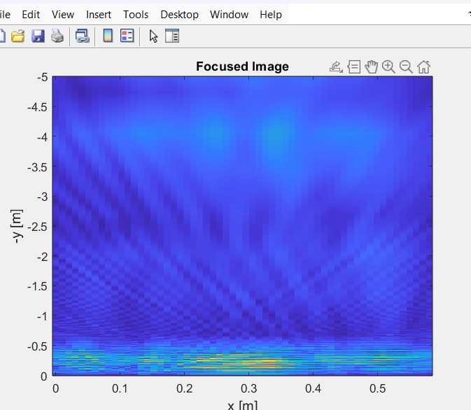

### PROJECT NAME: GROUND PENETRATING RADAR

### PROJECT DESCRIPTION: 
Our objective was to develop a radar system capable of scanning while moving along a specific axis over a defined distance. During this motion, it captures readings along the perpendicular axis. Once the scanning is complete, signal processing techniques are applied to generate a radargram, which provides insight into the presence and depth of non-uniform objects within the sample medium, mapped across the plane and depth along the perpendicular axis. 

We worked on two projects in parallel: Part A and Part B. Part A involved building the system entirely from scratch. However, due to limited resources for testing, simulation, and guidance, the chances of completing it successfully were relatively low. Therefore, we simultaneously pursued Part B, which utilized a radar module with a 24 GHz center frequency and an integrated analog front-end, similar to what we aimed to develop in Part A. While the hardware aspect in Part B was more accessible, the signal processing involved was more challenging compared to Part A.

## PART A 
#### Principle of operation:
The radar system is based on the Stepped Frequency Continuous Wave (SFCW) technique. The system captures scans at discrete intervals along the x-axis, and at each scan point, it transmits a signal that sweeps across 256 frequencies over a 600 MHz bandwidth (ranging from 300 MHz to 900 MHz). The y-axis resolution, which corresponds to depth resolution, is determined by the bandwidth, following the relation: Y_res = 2c/B, where c is the speed of light and B is the bandwidth.
#### Hardware and Signal Chain:
We used an STM32 Nucleo F103 microcontroller as the central controller. To generate the 256-frequency sweep, we utilized a MCP4725 DAC, which outputs a control voltage that is amplified using a non-inverting amplifier. This amplified signal drives a Voltage Controlled Oscillator (VCO) to generate the desired RF output. For impedance matching and signal conditioning, the RF signal is passed through an RF attenuator, Low Noise Amplifier (LNA), and bias tee before being transmitted through a Vivaldi antipodal antenna, We used two seperate such antenna as a receiver and transmitter.
#### Electromagnetic Principle:
According to electromagnetic wave physics, when an RF signal travels through a medium and encounters a non-uniform object, a change in permittivity results in partial reflection. The reflected signal, received by the antenna, carries a phase shift that is directly proportional to the depth of the object.
#### Receiver and Signal Processing:
The received signal undergoes impedance matching using another LNA and bias tee, and is then mixed with the transmitted signal using an RF mixer. The output of the mixer contains the phase difference information, which correlates with the depth of the target object. This mixed signal is filtered using a bandpass filter to extract the desired frequency components and is then sampled using the onboard ADC of the STM32 microcontroller. A Fast Fourier Transform (FFT) is applied to the digitized signal to convert the time-domain data into frequency-domain information. The frequency components correspond to depth, and the amplitude at each frequency represents the likelihood of a non-uniform object being present at that depth.
#### Visualization:
The radargram is displayed on an LCD screen, where the x-axis represents horizontal movement and the y-axis represents depth. The intensity of each pixel indicates the FFT amplitude at that point, reflecting the probability of an object being present.
#### Mechanical System:
The entire system, including electronics and antennas, is mounted on a mobile platform. This platform is moved along the x-axis using a stepper motor, motor driver, and wheels. The movement is controlled by hardcoding the time intervals based on the stepper motor’s RPM to achieve accurate spatial resolution along the x-axis for radargram generation.
#### Status of completion
We failed to find the correct compatible component for the external circuitary of the VCO so the output frequescies of the VCO was not the desired one according to requirement of the system, so finally we were not able to do integration our system. Apartment from the we were ready with rest of the things, like pcb and final code of system.
#### References:
[GPRino](https://hackaday.io/project/175115-gprino), by Mirel paun

## Part B:
#### Principle of operation:
This radar system is based on Frequency Modulated Continuous Wave (FMCW) technique. Similar to part A, here also system captures scans at discrete steps along the axes of translation. At each scan point, 933 frequencies over a range of 222MHz bandwidth (ranging from 24GHz to 24.25GHz) are sweeped. The y-axis resolution follows the same relation: Y_res = 2c/B
#### Hardware and Signal Chain:
The central component of this part is IVS-362 module which is a pre-built module to transmit variable frequencies in the K-band, centred at 24GHz. The module takes input voltage in the range of 0.7V to 2.5V to sweep from 24GHz to 24.25GHz. It has two antennas: one for transmitting and the other for receiving the signals. The signals are internally mixed and filtered in the module. The outputs IF1 and IF2 are I- and Q- amplitudes of the mixer. The IF1 output is further manipulated. The output is first downshifted using an OpAmp subtractor circuit to compensate the 2.8V DC offset introduced by the module internally, to finally bring the signal within the safe STM32 range of 0-3.3V.  This signal is transmitted and stored into the PC for further processing.  STM32 Nucleo F103RB is used as the microcontroller. It is used to generate the 933 frequency sweep using MCP4921 DAC over SPI communication.

#### Electromagnetic Principle:
According to electromagnetic wave physics, when an RF signal travels through a medium and encounters a non-uniform object, a change in permittivity results in partial reflection. The reflected signal, received by the antenna, carries a phase shift that is directly proportional to the depth of the object.
#### Signal Processing:
The downshifted mixed signal is sampled using the onboard ADC of the STM32 microcontroller. The received signal is buffered and transmitted to PC over UART for each x-point. A generic python code reads this data and stores it in a text file. This text file is further used by a MATLAB code to apply signal processing algorithm. A Synthetic Aperture Radar (SAR) technique is applied to the digitized signal to improve the range resolution considering factors like distnace and phase of the antenna relative to the target throughout its movement. Unlike the analysis in part-A, this is a time domain analysis. The frequency components correspond to depth, and the amplitude at each frequency represents the likelihood of a non-uniform object being present at that depth.
#### Visualization:
The radargram is displayed on the PC screen itself, in the MATLAB environment, where the x-axis represents horizontal movement and the y-axis represents depth. The final output comprises of hyperbolas centred at the coordinates of the targetted object.  

#### Mechanical System:
The IVS-362 module is mounted on a support being translated using the rack and pinion mechanism that moves along x-axis by 30cm. A stepper motor and driver are used to generate this movement. The movement is controlled by hardcoding the time intervals based on the stepper motor’s RPM to achieve accurate spatial resolution of 1.5cm along the x-axis for radargram generation. 
#### Status of completion
The final demo could translate by precise steps as desired, samples were collected synchronously and manipulated. 
#### References:
1. [Through-Wall Imaging Using Low-Cost Frequency-Modulated Continuous Wave Radar Sensors]([https://hackaday.io/project/175115-gprino], [https://github.com/miricip/Radar/blob/main/GB_SAR.zip]), by Mirel Paun
2. [Datasheet]([https://mm.digikey.com/Volume0/opasdata/d220001/medias/docus/3611/IVS-362_V1.3.pdf])
3. [Application notes by InnoSenT]([https://www.innosent.de/fileadmin/media/dokumente/Downloads/Application_Note_I_-_web.pdf],[https://www.innosent.de/fileadmin/media/dokumente/Downloads/Application_Note_II_-_web.pdf]

###  OVERALL LEARNING AND MISTAKES
From management perspective:
1. We learned time and project managment, got a more realistic approximation of time required at each stage of project.
2. Learned the importance of communication between teammates working on different parts of project and bridging different subsystems.
3. Learned the importance of overall system level planning/thinking requirement at each stage of project to connect all dots synchronously.
4. Learned efficient work delegation between all team members.
5. Realized the importance of pre-planning including all possible fallbacks, backup plan and buffer time in the timeline.

From technical perspective: 
1. Learned about EM wave principle, working principle and the physics behind the ground penetration radar.
2. Learned about Analog logic design, PCB design and how to read datasheets and a brief introduction to RF microelectronics.
3. Learned using STM32 microcontrolled, interfacing components using I2C, SPI protocol.
4. Learned about FFT, SAR and other signal processing techniques.
5. Learned designing effecient and compact mechanical design.
6. Gained insights about antenna analysis and the physics behind.
   
